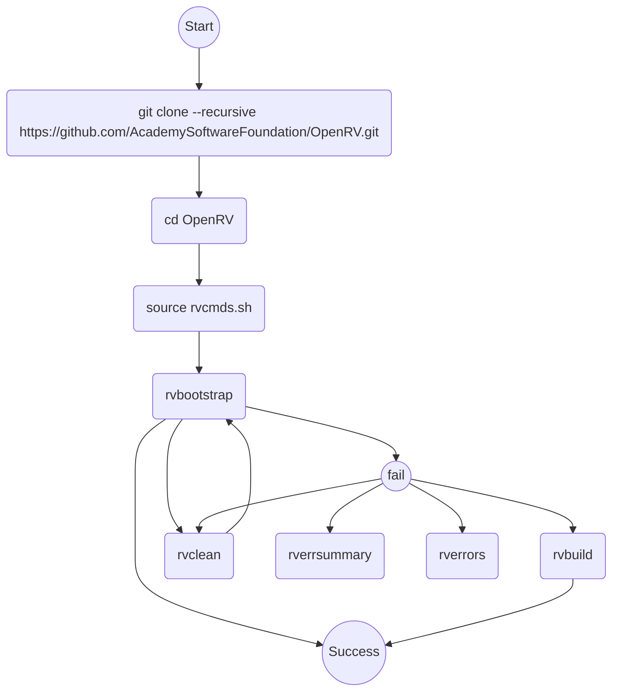

---

# Attempt 2026-05-06

## Step 1 - Build Docker Image

[Building with Docker](https://aswf-openrv.readthedocs.io/en/latest/build_system/config_linux_rocky89.html#building-with-docker-optional)

```
git clone --recursive https://github.com/AcademySoftwareFoundation/OpenRV.git
cd OpenRV/dockerfiles

# Needs a lot of disk space (~35GiB !!!):
docker build --tag openrv-rocky9 -f Dockerfile.Linux-Rocky9-CY2024 .
```

## Step 2 - Run the container and enter

```
# docker run --detach openrv-rocky9 /bin/bash -c "sleep infinity"
docker run --name OpenRV-BuildBox openrv-rocky9 /bin/bash -c "sleep infinity"

docker container exec -it OpenRV-BuildBox /bin/bash 
```


## Step 3 - Build OpenRV

[Building Open RV](https://aswf-openrv.readthedocs.io/en/latest/build_system/config_common_build.html)

```
git clone --recursive https://github.com/AcademySoftwareFoundation/OpenRV.git
cd OpenRV

source rvcmds.sh

# CY2025

# [First-time build only: rvbootstrap](https://aswf-openrv.readthedocs.io/en/latest/build_system/config_common_build.html#first-time-build-only-rvbootstrap)
rvbootstrap
# ════════════════════════════════════════════════════════════════
# ✗ BUILD FAILED - Error Summary
# ════════════════════════════════════════════════════════════════
# 
# 🔥 Compilation Errors Found:
# ────────────────────────────────────────────────────────────────
# FAILED: src/lib/audio/ALSASafeAudioModule/CMakeFiles/ALSASafeAudioModule.dir/ALSASafeAudioRenderer.cpp.o 
# /home/rv/OpenRV/src/lib/mu/Mu/Mu/config.h:129:10: fatal error: gc/gc.h: No such file or directory
# FAILED: RV_DEPS_PYTHON3/install/RV_DEPS_PYTHON3-requirements-flag /home/rv/OpenRV/_build/RV_DEPS_PYTHON3/install/RV_DEPS_PYTHON3-requirements-flag 
#   error: subprocess-exited-with-error
#       error: can't find Rust compiler
# error: failed-wheel-build-for-install
# ────────────────────────────────────────────────────────────────
# 
# 📝 Full build log: /home/rv/OpenRV/_build/build_errors.log
# 📝 Error summary: /home/rv/OpenRV/_build/error_summary.txt
# 
# 💡 Tips:
#   • Review the error summary above
#   • Check full log: less /home/rv/OpenRV/_build/build_errors.log
#   • Search for specific errors: grep -i 'your_error' /home/rv/OpenRV/_build/build_errors.log
# ════════════════════════════════════════════════════════════════


# [Building Open RV after the first time](https://aswf-openrv.readthedocs.io/en/latest/build_system/config_common_build.html#first-time-build-only-rvbootstrap)
# rvmk
```

> Note 1: launch the default optimized build unless you have a reason to want the unoptimized debug build.
> 
> Note 2: It’s possible that after boostrapping the build fails. If this happens, building again often fixes the problem. From the command line, call rvmk to complete the build.


## Bug Reports
- [ ] [[Bug]: Documentation outdated](https://github.com/AcademySoftwareFoundation/OpenRV/issues/1253)
- [ ] [[Bug]: can't find Rust compiler](https://github.com/AcademySoftwareFoundation/OpenRV/issues/1254)

---

# Attempt 2026-05-20

## Step 1 - Build Docker Image

```shell
mkdir testing
cd testing
```

[Building with Docker](https://aswf-openrv.readthedocs.io/en/latest/build_system/config_linux_rocky89.html#building-with-docker-optional)

```shell
git clone --recursive https://github.com/michimussato/OpenStudioLandscapes-ASWF-OpenRV.git
cd OpenStudioLandscapes-ASWF-OpenRV/dockerfiles
```

> [!TIP]
> 
> The next step nees a lot of disk space: (~35 GiB)!

### Dockerfile.Linux-Rocky9-CY2023

```shell
docker build --progress plain --shm-size=32g --tag openrv-rocky9-cy2023:$(date "+%Y-%m-%d_%H-%M-%S") --tag openrv-rocky9-cy2023:latest -f Dockerfile.Linux-Rocky9-CY2023 .
```

### Dockerfile.Linux-Rocky9-CY2024

```shell
docker build --progress plain --shm-size=32g --tag openrv-rocky9-cy2024:$(date "+%Y-%m-%d_%H-%M-%S") --tag openrv-rocky9-cy2024:latest -f Dockerfile.Linux-Rocky9-CY2024 .
```

## Step 2 - Run the container and enter

In two separate steps:

```shell
docker run --shm-size=32g --rm --name OpenRV-BuildBox-<VERSION> openrv-rocky9 /bin/bash -c "sleep infinity"
docker container exec -it OpenRV-BuildBox-<VERSION> /bin/bash
```

But we can combine the two steps into one as follows:

### CY2023

```shell
docker run --shm-size=32g --rm -it --name OpenRV-BuildBox-CY2023 openrv-rocky9-cy2023:latest /bin/bash
```

### CY2024

```shell
docker run --shm-size=32g --rm -it --name OpenRV-BuildBox-CY2024 openrv-rocky9-cy2024:latest /bin/bash
```

## Step 3 - Build OpenRV

[Building Open RV](https://aswf-openrv.readthedocs.io/en/latest/build_system/config_common_build.html)

```shell
git clone --recursive https://github.com/AcademySoftwareFoundation/OpenRV.git
cd OpenRV
source rvcmds.sh

# Please select the VFX Platform year to build for:
# 1) CY2023
# 2) CY2024
# 3) CY2025
# 4) CY2026
# Enter a number: 3
# Using VFX Platform: CY2025
# Searching for Qt installation...
# Found Qt 6.5 installation at /home/rv/Qt/6.5.3/gcc_64
# Please ensure you have installed any required dependencies from doc/build_system/config_[os]
# 
# CMake parameters:
# RV_BUILD_PARALLELISM is 8
# RV_HOME is /home/rv/OpenRV
# RV_BUILD_DIR is /home/rv/OpenRV/_build
# RV_INST_DIR is /home/rv/OpenRV/_install
# CMAKE_GENERATOR is Ninja
# QT_HOME is /home/rv/Qt/6.5.3/gcc_64
# 
# To override any of them do unset [name]; export [name]=value; source rvcmds.sh
# 
# Use 'rvrelease' (default) or 'rvdebug' to switch between build configurations.
# Call 'rvbootstrap' if its your first time building or after calling rvclean.
# After 'rvbootstrap', use 'rvbuild' or 'rvmk' for incremental builds.
# 
# If build fails, use 'rverrsummary' to see error summary or 'rverrors' to view full log.

# rvbootstrap is an alias for
# alias rvbootstrap='rvsetup && rvmk'
# rvbootstrap
# Hence, if the docs already suggest to run rvmk if rvbootstrap fails (which
# does leave me "mixed feelings", maybe it's just better to **not** use rvbootstrap
# as it is obviously condidered wonky).

rvsetup

# ════════════════════════════════════════════════════════════════
# ✗ BUILD FAILED - Error Summary
# ════════════════════════════════════════════════════════════════
# 🔥 Compilation Errors Found:
# ────────────────────────────────────────────────────────────────
# FAILED: src/lib/audio/ALSASafeAudioModule/CMakeFiles/ALSASafeAudioModule.dir/ALSASafeAudioRenderer.cpp.o 
# /home/rv/OpenRV/src/lib/mu/Mu/Mu/config.h:129:10: fatal error: gc/gc.h: No such file or directory
# FAILED: RV_DEPS_PYTHON3/install/RV_DEPS_PYTHON3-requirements-flag /home/rv/OpenRV/_build/RV_DEPS_PYTHON3/install/RV_DEPS_PYTHON3-requirements-flag 
# error: subprocess-exited-with-error
#     error: can't find Rust compiler
# error: failed-wheel-build-for-install
# ────────────────────────────────────────────────────────────────
# 📝 Full build log: /home/rv/OpenRV/_build/build_errors.log
# 📝 Error summary: /home/rv/OpenRV/_build/error_summary.txt
# 💡 Tips:
# • Review the error summary above
# • Check full log: less /home/rv/OpenRV/_build/build_errors.log
# • Search for specific errors: command grep -i 'your_error' /home/rv/OpenRV/_build/build_errors.log
# ════════════════════════════════════════════════════════════════

rvbuild
```




Checking VFX Platform to build for `Dockerfile.Linux-Rocky9-CY2023`:
- [x] 1) CY2023 <- `source rvcmds.sh` <- ~~`rvbootstrap`~~ <- ~~`rvbuild`~~
- [x] 2) CY2024 <- ~~`source rvcmds.sh`~~ <- ~~`rvbootstrap`~~ <- ~~`rvbuild`~~
- [x] 3) CY2025 <- ~~`source rvcmds.sh`~~ <- ~~`rvbootstrap`~~ <- ~~`rvbuild`~~
- [x] 4) CY2026 <- ~~`source rvcmds.sh`~~ <- ~~`rvbootstrap`~~ <- ~~`rvbuild`~~


Checking VFX Platform to build for `Dockerfile.Linux-Rocky9-CY2024`:
- [x] 1) CY2023 <- ~~`source rvcmds.sh`~~ <- ~~`rvbootstrap`~~ <- ~~`rvbuild`~~
- [x] 2) CY2024 <- `source rvcmds.sh` <- ~~`rvbootstrap`~~ <- ~~`rvbuild`~~
- [ ] 3) CY2025 <- `source rvcmds.sh` <- `rvbootstrap` <- `rvbuild`
- [ ] 4) CY2026 <- `source rvcmds.sh` <- `rvbootstrap` <- `rvbuild`


```
════════════════════════════════════════════════════════════════
✗ BUILD FAILED - Error Summary
════════════════════════════════════════════════════════════════

🔥 Compilation Errors Found:
────────────────────────────────────────────────────────────────
FAILED: src/lib/audio/ALSASafeAudioModule/CMakeFiles/ALSASafeAudioModule.dir/ALSASafeAudioRenderer.cpp.o 
/home/rv/OpenRV/src/lib/mu/Mu/Mu/config.h:129:10: fatal error: gc/gc.h: No such file or directory
────────────────────────────────────────────────────────────────

📝 Full build log: /home/rv/OpenRV/_build/build_errors.log
📝 Error summary: /home/rv/OpenRV/_build/error_summary.txt

💡 Tips:
  • Review the error summary above
  • Check full log: less /home/rv/OpenRV/_build/build_errors.log
  • Search for specific errors: command grep -i 'your_error' /home/rv/OpenRV/_build/build_errors.log
════════════════════════════════════════════════════════════════

rel (.venv) [rv@d4cb9d368940 OpenRV]$ rvbuild
Building target: main_executable
Build errors will be logged to: /home/rv/OpenRV/_build/build_errors.log

Change Dir: '/home/rv/OpenRV/_build'

[...]

✓ Build completed successfully!
```