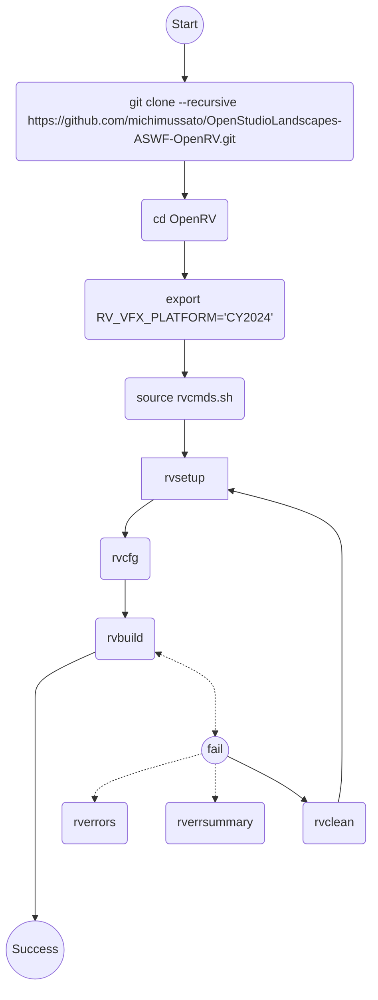

[](https://github.com/michimussato/OpenStudioLandscapes)

---

<!-- TOC -->
* [Build OpenRV with Docker](#build-openrv-with-docker)
  * [Overview - Decision Tree](#overview---decision-tree)
  * [Step 1 - Build Docker Image](#step-1---build-docker-image)
    * [Dockerfile.Linux-Rocky9-CY2024](#dockerfilelinux-rocky9-cy2024)
  * [Step 2 - Run the container and enter](#step-2---run-the-container-and-enter)
    * [CY2024](#cy2024)
  * [Step 3 - Build OpenRV](#step-3---build-openrv)
  * [Step 4 - Extract Stage Folder to local Machine](#step-4---extract-stage-folder-to-local-machine)
<!-- TOC -->

---

# Build OpenRV with Docker

Successful Builds:
- 12/06/2026

## Overview - Decision Tree

Simplified decision tree:



## Step 1 - Build Docker Image

[Building with Docker](https://aswf-openrv.readthedocs.io/en/latest/build_system/config_linux_rocky89.html#building-with-docker-optional)

```shell
git clone --recursive https://github.com/michimussato/OpenStudioLandscapes-ASWF-OpenRV.git
cd OpenStudioLandscapes-ASWF-OpenRV
```

> [!TIP]
> 
> The next step nees a lot of disk space: (~35 GiB)!

### Dockerfile.Linux-Rocky9-CY2024

```shell
docker build \
    --progress plain \
    --shm-size=32g \
    --tag openstudiolandscapes-aswf-openrv-rocky9-cy2024:$(date "+%Y-%m-%d_%H-%M-%S") \
    --tag openstudiolandscapes-aswf-openrv-rocky9-cy2024:latest \
    --file dockerfiles/Dockerfile.Linux-Rocky9-CY2024 \
    ./dockerfiles --no-cache
# Disable cache: --no-cache
```

## Step 2 - Run the container and enter

### CY2024

```shell
docker run \
    --shm-size=32g \
    --rm \
    --interactive \
    --tty \
    --name OpenStudioLandscapes-ASWF-OpenRV-BuildBox-CY2024 \
    openstudiolandscapes-aswf-openrv-rocky9-cy2024:latest /bin/bash
```

## Step 3 - Build OpenRV

[Building Open RV](https://aswf-openrv.readthedocs.io/en/latest/build_system/config_common_build.html)

```shell
git clone --recursive https://github.com/AcademySoftwareFoundation/OpenRV.git
cd OpenRV
# Set RV_VFX_PLATFORM to 2024 so that we won't be confronted with an interactive
# questionnaire:
export RV_VFX_PLATFORM="CY2024"
source rvcmds.sh

# rvbootstrap is an alias
# alias rvbootstrap='rvsetup && rvmk'
# Hence, if the docs already suggest to run rvmk if rvbootstrap fails (which
# does leave "mixed feelings"), maybe it's just better to **not** use rvbootstrap
# in the first place as it is obviously considered wonky.
#
# Simpler approach:
rvsetup && rvcfg && rvbuild || rvbuild
```

## Step 4 - Extract Stage Folder to local Machine

```shell
# Container id is the same as the one used in the step above
docker cp \
    OpenStudioLandscapes-ASWF-OpenRV-BuildBox-CY2024:/home/rv/OpenRV/_build/stage \
    ./OpenStudioLandscapes-ASWF-OpenRV-BuildBox-CY2024_Stage
```

Extract Logs:

```
docker cp \
    OpenStudioLandscapes-ASWF-OpenRV-BuildBox-CY2024:/home/rv/OpenRV/_build/error_summary.txt \
    ./OpenStudioLandscapes-ASWF-OpenRV-BuildBox-CY2024_Stage || echo "No error summary log found. Build may have succeeded or not run yet."

docker cp \
    OpenStudioLandscapes-ASWF-OpenRV-BuildBox-CY2024:/home/rv/OpenRV/_build/build_errors.log \
    ./OpenStudioLandscapes-ASWF-OpenRV-BuildBox-CY2024_Stage || echo "No build error log found. Build may have succeeded or not run yet."
```
