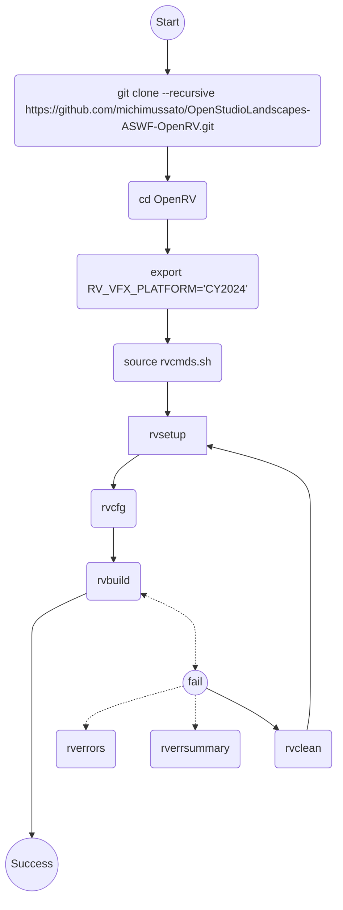
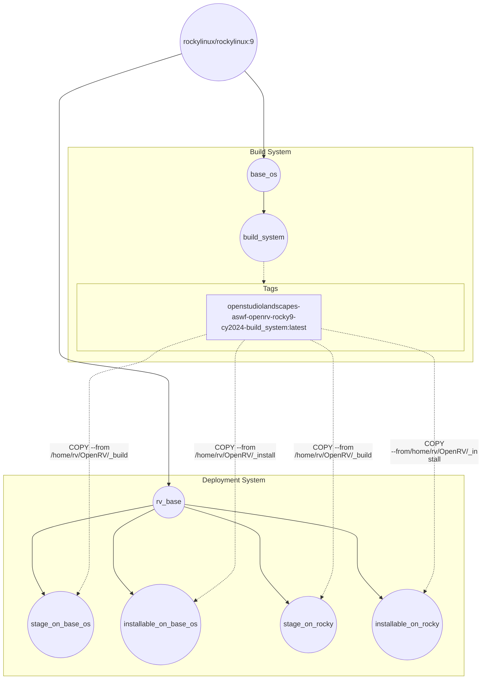

[](https://github.com/michimussato/OpenStudioLandscapes)

---

<!-- TOC -->
* [Build OpenRV with Docker](#build-openrv-with-docker)
  * [Overview - Decision Tree](#overview---decision-tree)
  * [Step 1 - Build Docker Image](#step-1---build-docker-image)
    * [Dockerfile.Linux-Rocky9-CY2024](#dockerfilelinux-rocky9-cy2024)
  * [Step 2 - Run the container and enter](#step-2---run-the-container-and-enter)
    * [CY2024](#cy2024)
  * [Step 3 - Build OpenRV](#step-3---build-openrv)
  * [Step 4 - Extract Stage Folder to local Machine](#step-4---extract-stage-folder-to-local-machine)
    * [Stage](#stage)
    * [Installable Package](#installable-package)
    * [Build Logs](#build-logs)
<!-- TOC -->

---

# Build OpenRV with Docker

## Overview - Decision Tree

Simplified decision tree:



## Step 1 - Build Docker Image

[Building with Docker](https://aswf-openrv.readthedocs.io/en/latest/build_system/config_linux_rocky89.html#building-with-docker-optional)

```shell
git clone --recursive https://github.com/michimussato/OpenStudioLandscapes-ASWF-OpenRV.git
cd OpenStudioLandscapes-ASWF-OpenRV
```

> [!TIP]
> 
> The next step nees a lot of disk space: (~35 GiB)!

### Dockerfile.Linux-Rocky9-CY2024

#### Create Builder

> [!TIP]
> 
> Prevent Docker Log Clipping for this build
> - i.e. [output clipped, log limit 2MiB reached]

`buildx`
- https://github.com/docker/buildx/issues/484#issuecomment-3299100959
- https://oneuptime.com/blog/post/2026-02-08-how-to-use-docker-buildx-commands-for-advanced-builds/view
- https://docs.docker.com/build/builders/drivers/


```shell
# https://docs.docker.com/build/builders/drivers/docker-container/
docker buildx \
    create \
    --name openrv_builder \
    --driver docker-container \
    --driver-opt default-load=true \
    --driver-opt env.BUILDKIT_STEP_LOG_MAX_SPEED=-1 \
    --driver-opt env.BUILDKIT_STEP_LOG_MAX_SIZE=-1
```

> [!IMPORTANT]
> 
> Don't remove custom builder if cache is needed
> - https://docs.docker.com/build/cache/backends/local/
> `docker buildx rm openrv_builder`
> or remove it with [`--keep-state`](https://docs.docker.com/build/builders/drivers/docker-container/#cache-persistence)

#### Build to Target



##### `rv_build`

> [!TIP]
> 
> This takes a lot of time, uses 
> up a lot of space (~35GiB) and 
> caching does not seem to work for 
> the `Qt` installation layers.
> For testing, it makes a lot of sense
> to break this step out and create 
> an image from it so that we can
> re-use it for subsequent steps.

Build `rv_build`

```shell
# stage
export TARGET="rv_build"

LOGS=./dockerfiles/.logs
mkdir -p ${LOGS}

# ls && la && whoami || pwd && ls -alh
# https://www.funwithlinux.net/blog/setting-environment-variables-for-multiple-commands-in-bash-one-liner/

# while fail, retry
# - https://stackoverflow.com/a/12967264/2207196
# while ! i_can_fail; do :; done

DOCKERFILE="Dockerfile.Linux-Rocky9-CY2024" \
TIMESTAMP=$(date +"%Y-%m-%d_%H-%M-%S") \
NTFY_RSNAPSHOT_TOKEN=tk_amlipjwa7eb3rpxd00rsdshz5vyh5 \
    && /usr/bin/curl \
        -H "X-Title: OpenRV" \
        -H "Authorization: Bearer ${NTFY_RSNAPSHOT_TOKEN}" \
        -d "Build to target ${TARGET} started..." https://ntfy.pangolin.openstudiolandscapes.cloud-ip.cc/builds \
    && time docker build \
        --builder openrv_builder \
        --load \
        --target ${TARGET} \
        --output type=docker \
        --progress plain \
        --shm-size=32g \
        --tag openstudiolandscapes-aswf-openrv-rocky9-cy2024-${TARGET}:${TIMESTAMP} \
        --tag openstudiolandscapes-aswf-openrv-rocky9-cy2024-${TARGET}:latest \
        --file dockerfiles/${DOCKERFILE} \
        ./dockerfiles \
        > >(tee -a ${LOGS}/${DOCKERFILE}.${TARGET}.${TIMESTAMP}.STDOUT.log) \
        2> >(tee -a ${LOGS}/${DOCKERFILE}.${TARGET}.${TIMESTAMP}.STDERR.log >&2) \
    && /usr/bin/curl \
        -H "X-Title: OpenRV" \
        -H "Authorization: Bearer ${NTFY_RSNAPSHOT_TOKEN}" \
        -d "Build to target ${TARGET} finished." https://ntfy.pangolin.openstudiolandscapes.cloud-ip.cc/builds \
    || /usr/bin/curl \
        -H "X-Title: OpenRV" \
        -H "Authorization: Bearer ${NTFY_RSNAPSHOT_TOKEN}" \
        -d "Build to target ${TARGET} failed." https://ntfy.pangolin.openstudiolandscapes.cloud-ip.cc/builds
```

> [!TIP]
> 
> To enter `rv_build` interactively:
> ```shell
> export TARGET="rv_build"
> 
> docker run \
>     --shm-size=32g \
>     --rm \
>     --interactive \
>     --tty \
>     --name OpenStudioLandscapes-ASWF-OpenRV-BuildBox-CY2024-${TARGET} \
>     openstudiolandscapes-aswf-openrv-rocky9-cy2024-${TARGET}:latest /bin/bash
> ```
> 
> To create a `tar` archive from the resulting build:
> References:
> - [Creating a tarball for distribution (without user/group information)](https://billauer.se/blog/2020/11/tar-create-owner-group/)
> ```shell
> source /etc/os-release
> mkdir -p /root/OpenRV/tarballs
> pushd /root/OpenRV/tarballs || exit 1
> 
> tar -C /root/OpenRV/_install \
>     --owner=0 \
>     --group=0 \
>     --mode='og-w' \
>     --create \
>     --verbose \
>     --file - . \
>     | xz \
>     --verbose \
>     --threads=0 \
>     -9 \
>     --stdout - \
>     > OpenRV-$(/home/rv/OpenRV/_install/bin/rv -version)-${ROCKY_SUPPORT_PRODUCT}-$(uname --hardware-platform).tar.xz
> 
> popd || exit 1
> 
> # Test Integrity
> tar -C /root/OpenRV/tarballs --verbose --list --file ./tarballs/OpenRV-$(/root/OpenRV/_install/bin/rv -version)-${ROCKY_SUPPORT_PRODUCT}-$(uname --hardware-platform).tar.xz > /dev/null
> ```
> 
> To copy the resulting `tar` archive to the Docker host:
> ```shell
> export TARGET="rv_build"
> 
> mkdir -p ./OpenStudioLandscapes-ASWF-OpenRV-BuildBox-CY2024-${TARGET}
> docker cp \
>     OpenStudioLandscapes-ASWF-OpenRV-BuildBox-CY2024-${TARGET}:/root/OpenRV/tarballs/. \
>     ./OpenStudioLandscapes-ASWF-OpenRV-BuildBox-CY2024-${TARGET}
> ```

##### `rv_rocky`

```shell
export TARGET="rv_rocky"

LOGS=./dockerfiles/.logs
mkdir -p ${LOGS}

# use `time`?
# custom builder causes issue (--builder openrv_builder):
# #5 [internal] load metadata for docker.io/library/openstudiolandscapes-aswf-openrv-rocky9-cy2024-build_system:latest
# #5 ERROR: pull access denied, repository does not exist or may require authorization: server message: insufficient_scope: authorization failed
# ------
#  > [internal] load metadata for docker.io/library/openstudiolandscapes-aswf-openrv-rocky9-cy2024-build_system:latest:
# ------
# Dockerfile.Linux-Rocky9-CY2024:365
# --------------------
#  363 |     #WORKDIR ${RV_INST_DIR}
#  364 |     
#  365 | >>> COPY --from=openstudiolandscapes-aswf-openrv-rocky9-cy2024-build_system:latest "/home/rv/OpenRV/_install" "/opt/rv"
#  366 |     #COPY --from=build_system "/home/rv/OpenRV/_install" "/opt/rv"
#  367 |     #COPY --from=build_system "/home/rv/OpenRV/_install" "/opt/rv"
# --------------------
# ERROR: failed to build: failed to solve: openstudiolandscapes-aswf-openrv-rocky9-cy2024-build_system:latest: failed to resolve source metadata for docker.io/library/openstudiolandscapes-aswf-openrv-rocky9-cy2024-build_system:latest: pull access denied, repository does not exist or may require authorization: server message: insufficient_scope: authorization failed

DOCKERFILE="Dockerfile.Linux-Rocky9-CY2024" \
TIMESTAMP=$(date +"%Y-%m-%d_%H-%M-%S") \
NTFY_RSNAPSHOT_TOKEN=tk_amlipjwa7eb3rpxd00rsdshz5vyh5 \
    && /usr/bin/curl \
        -H "X-Title: OpenRV" \
        -H "Authorization: Bearer ${NTFY_RSNAPSHOT_TOKEN}" \
        -d "Build to target ${TARGET} started..." https://ntfy.pangolin.openstudiolandscapes.cloud-ip.cc/builds \
    && time docker build \
    --builder openrv_builder \
    --load \
    --target ${TARGET} \
    --output type=docker \
    --progress plain \
    --shm-size=32g \
    --tag openstudiolandscapes-aswf-openrv-rocky9-cy2024-${TARGET}:${TIMESTAMP} \
    --tag openstudiolandscapes-aswf-openrv-rocky9-cy2024-${TARGET}:latest \
    --file dockerfiles/${DOCKERFILE} \
    ./dockerfiles \
    > >(tee -a ${LOGS}/${DOCKERFILE}.${TARGET}.${TIMESTAMP}.STDOUT.log) \
    2> >(tee -a ${LOGS}/${DOCKERFILE}.${TARGET}.${TIMESTAMP}.STDERR.log >&2) \
    && /usr/bin/curl \
        -H "X-Title: OpenRV" \
        -H "Authorization: Bearer ${NTFY_RSNAPSHOT_TOKEN}" \
        -d "Build to target ${TARGET} finished." https://ntfy.pangolin.openstudiolandscapes.cloud-ip.cc/builds \
    || /usr/bin/curl \
        -H "X-Title: OpenRV" \
        -H "Authorization: Bearer ${NTFY_RSNAPSHOT_TOKEN}" \
        -d "Build to target ${TARGET} failed." https://ntfy.pangolin.openstudiolandscapes.cloud-ip.cc/builds
```

> [!TIP]
> 
> To enter `rv_rocky` interactively:
> ```shell
> export TARGET="rv_rocky"
> 
> docker run \
>     --shm-size=32g \
>     --rm \
>     --interactive \
>     --tty \
>     --name OpenStudioLandscapes-ASWF-OpenRV-BuildBox-CY2024-${TARGET} \
>     openstudiolandscapes-aswf-openrv-rocky9-cy2024-${TARGET}:latest /bin/bash
> ```


## Step 2 - Run the container and enter

### CY2024

```shell
docker run \
    --shm-size=32g \
    --rm \
    --interactive \
    --tty \
    --name OpenStudioLandscapes-ASWF-OpenRV-BuildBox-CY2024 \
    openstudiolandscapes-aswf-openrv-rocky9-cy2024-${TARGET}:latest /bin/bash
```

## Step 3 - Build OpenRV

[Building Open RV](https://aswf-openrv.readthedocs.io/en/latest/build_system/config_common_build.html)

```shell
git clone --recursive https://github.com/AcademySoftwareFoundation/OpenRV.git
cd OpenRV
# Set RV_VFX_PLATFORM to 2024 so that we won't be confronted with an interactive
# questionnaire:
export RV_VFX_PLATFORM="CY2024"
source rvcmds.sh

# rvbootstrap is an alias
# alias rvbootstrap='rvsetup && rvmk'
# Hence, if the docs already suggest to run rvmk if rvbootstrap fails (which
# does leave "mixed feelings"), maybe it's just better to **not** use rvbootstrap
# in the first place as it is obviously considered wonky.
#
# Simpler approach:
rvsetup && rvcfg && rvbuild || rvbuild

# Non Free Codecs
# alias rvcfg='rvhomedir && rvenv && cmake -B ${RV_BUILD_DIR} -G "${CMAKE_GENERATOR}" ${RV_TOOLCHAIN} ${CMAKE_WIN_ARCH} -DCMAKE_BUILD_TYPE=${RV_BUILD_TYPE} -DRV_DEPS_QT_LOCATION=${QT_HOME} -DRV_VFX_PLATFORM=${RV_VFX_PLATFORM} -DRV_DEPS_WIN_PERL_ROOT=${WIN_PERL}'
# FFMPEG
# rvcfg -DRV_FFMPEG_NON_FREE_DECODERS_TO_ENABLE="aac;hevc" -DRV_FFMPEG_NON_FREE_ENCODERS_TO_ENABLE="aac"
# ProRes
# https://aswf-openrv.readthedocs.io/en/latest/build_system/config_common_build.html#apple-prores

# Creating Installation Package
# https://aswf-openrv.readthedocs.io/en/latest/build_system/config_common_build.html#creating-the-installation-package
# alias rvinst='rvenv && cmake --install ${RV_BUILD_DIR} --prefix ${RV_INST_DIR} --config ${RV_BUILD_TYPE}'
# rel (.venv) [rv@c865f3be91dd OpenRV]$ echo ${RV_BUILD_DIR}
# /home/rv/OpenRV/_build
# rel (.venv) [rv@c865f3be91dd OpenRV]$ echo ${RV_INST_DIR}
# /home/rv/OpenRV/_install
# rel (.venv) [rv@c865f3be91dd OpenRV]$ echo ${RV_BUILD_TYPE}
# Release
# cmake --install _build --prefix _install
cmake --install ${RV_BUILD_DIR} --prefix ${RV_INST_DIR} --config ${RV_BUILD_TYPE}
```

## Step 4 - Extract Stage Folder to local Machine

### Stage

```shell
mkdir -p ./OpenStudioLandscapes-ASWF-OpenRV-BuildBox-CY2024/stage

# Container id is the same as the one used in the step above
docker cp \
    OpenStudioLandscapes-ASWF-OpenRV-BuildBox-CY2024:/home/rv/OpenRV/_build/stage/. \
    ./OpenStudioLandscapes-ASWF-OpenRV-BuildBox-CY2024/stage
```

### Installable Package

```shell
mkdir -p ./OpenStudioLandscapes-ASWF-OpenRV-BuildBox-CY2024/install

# Container id is the same as the one used in the step above
docker cp \
    OpenStudioLandscapes-ASWF-OpenRV-BuildBox-CY2024:/home/rv/OpenRV/_install/. \
    ./OpenStudioLandscapes-ASWF-OpenRV-BuildBox-CY2024/install
```

### Build Logs

```shell
mkdir -p ./OpenStudioLandscapes-ASWF-OpenRV-BuildBox-CY2024/logs

docker cp \
    OpenStudioLandscapes-ASWF-OpenRV-BuildBox-CY2024:/home/rv/OpenRV/_build/error_summary.txt \
    ./OpenStudioLandscapes-ASWF-OpenRV-BuildBox-CY2024/logs || echo "No error summary log found. Build may have succeeded or not run yet."

docker cp \
    OpenStudioLandscapes-ASWF-OpenRV-BuildBox-CY2024:/home/rv/OpenRV/_build/build_errors.log \
    ./OpenStudioLandscapes-ASWF-OpenRV-BuildBox-CY2024/logs || echo "No build error log found. Build may have succeeded or not run yet."
```
