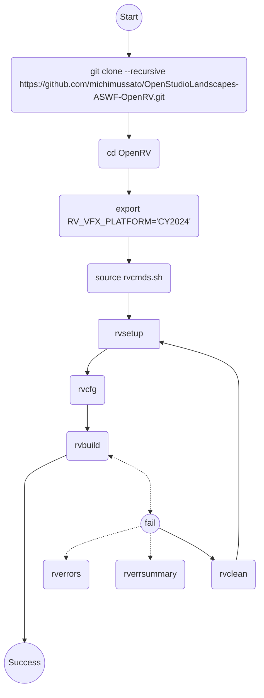

[](https://github.com/michimussato/OpenStudioLandscapes)

---

<!-- TOC -->
* [Attempt 2026-05-20](#attempt-2026-05-20)
  * [Step 1 - Build Docker Image](#step-1---build-docker-image)
    * [Dockerfile.Linux-Rocky9-CY2024](#dockerfilelinux-rocky9-cy2024)
  * [Step 2 - Run the container and enter](#step-2---run-the-container-and-enter)
    * [CY2024](#cy2024)
  * [Step 3 - Build OpenRV](#step-3---build-openrv)
<!-- TOC -->

---

# Attempt 2026-05-20

## Step 1 - Build Docker Image

[Building with Docker](https://aswf-openrv.readthedocs.io/en/latest/build_system/config_linux_rocky89.html#building-with-docker-optional)

```shell
git clone --recursive https://github.com/michimussato/OpenStudioLandscapes-ASWF-OpenRV.git
cd OpenStudioLandscapes-ASWF-OpenRV
```

> [!TIP]
> 
> The next step nees a lot of disk space: (~35 GiB)!

### Dockerfile.Linux-Rocky9-CY2024

```shell
docker build \
    --progress plain \
    --shm-size=32g \
    --tag openstudiolandscapes-aswf-openrv-rocky9-cy2024:$(date "+%Y-%m-%d_%H-%M-%S") \
    --tag openstudiolandscapes-aswf-openrv-rocky9-cy2024:latest \
    --file dockerfiles/Dockerfile.Linux-Rocky9-CY2024 \
    ./dockerfiles
# Disable cache: --no-cache
```

## Step 2 - Run the container and enter

### CY2024

```shell
docker run \
    --shm-size=32g \
    --rm \
    --interactive \
    --tty \
    --name OpenStudioLandscapes-ASWF-OpenRV-BuildBox-CY2024 \
    openstudiolandscapes-aswf-openrv-rocky9-cy2024:latest /bin/bash
```

## Step 3 - Build OpenRV

[Building Open RV](https://aswf-openrv.readthedocs.io/en/latest/build_system/config_common_build.html)

```shell
git clone --recursive https://github.com/AcademySoftwareFoundation/OpenRV.git
cd OpenRV
# Set RV_VFX_PLATFORM to 2024 so that we won't be confronted with an interactive
# questionnaire:
export RV_VFX_PLATFORM="CY2024"
source rvcmds.sh

# rvbootstrap is an alias
# alias rvbootstrap='rvsetup && rvmk'
# Hence, if the docs already suggest to run rvmk if rvbootstrap fails (which
# does leave "mixed feelings"), maybe it's just better to **not** use rvbootstrap
# in the first place as it is obviously considered wonky.
#
# Simpler approach:
rvsetup && rvcfg && rvbuild || rvbuild
```

Simplified tree:




Checking VFX Platform to build for `Dockerfile.Linux-Rocky9-CY2024`:
- [x] ~~1) CY2023 <- `source rvcmds.sh`~~ <- ~~`rvbootstrap`~~ <- ~~`rvbuild`~~
- [x] 2) CY2024 -> `source rvcmds.sh` -> `rvsetup` -> `rvbuild`
- [ ] 3) CY2025 <- `source rvcmds.sh` <- `rvbootstrap` <- `rvbuild`
- [ ] 4) CY2026 <- `source rvcmds.sh` <- `rvbootstrap` <- `rvbuild`
