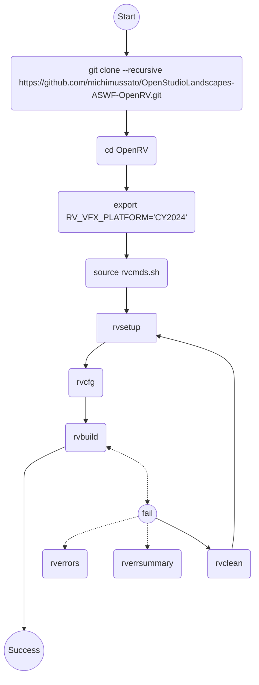
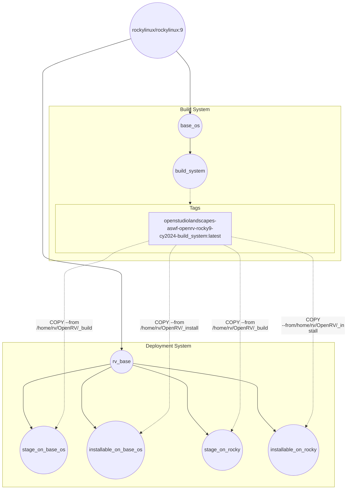

[](https://github.com/michimussato/OpenStudioLandscapes)

---

<!-- TOC -->
* [Repository](#repository)
* [Build OpenRV with Docker](#build-openrv-with-docker)
  * [Overview - Decision Tree](#overview---decision-tree)
  * [Step 1 - Build Docker Image](#step-1---build-docker-image)
    * [Dockerfile.Linux-Rocky9-CY2024](#dockerfilelinux-rocky9-cy2024)
      * [Disable Log Clipping](#disable-log-clipping)
      * [Build to Target](#build-to-target)
      * [Run a Target](#run-a-target)
        * [`openrv_base`](#openrv_base)
        * [`rv_clone`](#rv_clone)
        * [`rv_configure`](#rv_configure)
        * [`rv_dependencies`](#rv_dependencies)
        * [`rv_build`](#rv_build)
        * [`rv_install`](#rv_install)
        * [`rv_rocky`](#rv_rocky)
  * [Step 2 - Run the container and enter](#step-2---run-the-container-and-enter)
    * [CY2024](#cy2024)
  * [Step 3 - Build OpenRV](#step-3---build-openrv)
  * [Step 4 - Extract Stage Folder to local Machine](#step-4---extract-stage-folder-to-local-machine)
    * [Stage](#stage)
    * [Installable Package](#installable-package)
    * [Build Logs](#build-logs)
<!-- TOC -->

---

# Repository

Checkout repo and sync tags with upstream:

```shell
git clone --recursive https://github.com/michimussato/OpenStudioLandscapes-ASWF-OpenRV
cd OpenStudioLandscapes-ASWF-OpenRV
git remote add upstream https://github.com/AcademySoftwareFoundation/OpenRV
git fetch --tags upstream
git push --tags
```

# Build OpenRV with Docker

## Overview - Decision Tree

Simplified decision tree:



## Step 1 - Build Docker Image

[Building with Docker](https://aswf-openrv.readthedocs.io/en/latest/build_system/config_linux_rocky89.html#building-with-docker-optional)

```shell
git clone --recursive https://github.com/michimussato/OpenStudioLandscapes-ASWF-OpenRV.git
cd OpenStudioLandscapes-ASWF-OpenRV
```

> [!TIP]
> 
> The next step nees a lot of disk space: (~35 GiB)!

### Dockerfile.Linux-Rocky9-CY2024

#### Disable Log Clipping

> [!TIP]
> 
> Prevent Docker Log Clipping for this build
> - i.e. [output clipped, log limit 2MiB reached]

Add

```
Environment="BUILDKIT_STEP_LOG_MAX_SIZE=-1"
Environment="BUILDKIT_STEP_LOG_MAX_SPEED=-1"
```

to the `[service]` section in `/usr/lib/systemd/system/docker.service`
and

```shell
sudo systemctl daemon-reload
sudo systemctl restart docker.service
```

> [!TIP]
> 
> To revent Docker Log Clipping, we could also create
> and use a custom builder:
> ```shell
> # https://docs.docker.com/build/builders/drivers/docker-container/
> docker \
>     --debug \
>     --config /home/michael/.local/share/OpenStudioLandscapes/.landscapes/2026-06-25_08-51-54__healthy-showy-muddled-building/OpenStudioLandscapes/OpenStudioLandscapes_Base__docker_config_json \
>     buildx \
>     create \
>     --name openrv_builder \
>     --driver docker-container \
>     --driver-opt default-load=true \
>     --driver-opt env.BUILDKIT_STEP_LOG_MAX_SPEED=-1 \
>     --driver-opt env.BUILDKIT_STEP_LOG_MAX_SIZE=-1
> ```
> 
> Apparently, we run into other issues when using
> a custom builder:
> - when using a local image:
>   ```
>   #5 [internal] load metadata for docker.io/library/openstudiolandscapes-aswf-openrv-rocky9-cy2024-build_system:latest
>   #5 ERROR: pull access denied, repository does not exist or may require authorization: server message: insufficient_scope: authorization failed
>   ------
>    > [internal] load metadata for docker.io/library/openstudiolandscapes-aswf-openrv-rocky9-cy2024-build_system:latest:
>   ------
>   Dockerfile.Linux-Rocky9-CY2024:365
>   --------------------
>    363 |     #WORKDIR ${RV_INST_DIR}
>    364 |     
>    365 | >>> COPY --from=openstudiolandscapes-aswf-openrv-rocky9-cy2024-build_system:latest "/home/rv/OpenRV/_install" "/opt/rv"
>    366 |     #COPY --from=build_system "/home/rv/OpenRV/_install" "/opt/rv"
>    367 |     #COPY --from=build_system "/home/rv/OpenRV/_install" "/opt/rv"
>   --------------------
>   ERROR: failed to build: failed to solve: openstudiolandscapes-aswf-openrv-rocky9-cy2024-build_system:latest: failed to resolve source metadata for docker.io/library/openstudiolandscapes-aswf-openrv-rocky9-cy2024-build_system:latest: pull access denied, repository does not exist or may require authorization: server message: insufficient_scope: authorization failed
>   ```
> - when using a self signed CA certificate:
>   ```
>   #2 [internal] load metadata for registry.openstudiolandscapes.lan:5000/openrv/openstudiolandscapes-aswf-openrv-rocky9-cy2024-openrv_base:latest
>   #2 ERROR: failed to do request: Head "https://registry.openstudiolandscapes.lan:5000/v2/openrv/openstudiolandscapes-aswf-openrv-rocky9-cy2024-openrv_base/manifests/latest": tls: failed to verify certificate: x509: certificate signed by unknown authority
>   ------
>    > [internal] load metadata for registry.openstudiolandscapes.lan:5000/openrv/openstudiolandscapes-aswf-openrv-rocky9-cy2024-openrv_base:latest:
>   ------
>   Dockerfile.Linux-Rocky9-CY2024:159
>   --------------------
>    157 |     
>    158 |     # Stage 2
>    159 | >>> FROM registry.openstudiolandscapes.lan:5000/openrv/openstudiolandscapes-aswf-openrv-rocky9-cy2024-openrv_base:latest AS rv_build
>    160 |     
>    161 |     USER rv
>   --------------------
>   ERROR: failed to build: failed to solve: registry.openstudiolandscapes.lan:5000/openrv/openstudiolandscapes-aswf-openrv-rocky9-cy2024-openrv_base:latest: failed to resolve source metadata for registry.openstudiolandscapes.lan:5000/openrv/openstudiolandscapes-aswf-openrv-rocky9-cy2024-openrv_base:latest: failed to do request: Head "https://registry.openstudiolandscapes.lan:5000/v2/openrv/openstudiolandscapes-aswf-openrv-rocky9-cy2024-openrv_base/manifests/latest": tls: failed to verify certificate: x509: certificate signed by unknown authority
>   ```
> 
> Don't remove custom builder if cache is needed
> - https://docs.docker.com/build/cache/backends/local/
> ```shell
> docker \
>     --debug \
>     --config /home/michael/.local/share/OpenStudioLandscapes/.landscapes/2026-06-25_08-51-54__healthy-showy-muddled-building/OpenStudioLandscapes/OpenStudioLandscapes_Base__docker_config_json \
>     buildx rm openrv_builder
> ```
> or remove it with [`--keep-state`](https://docs.docker.com/build/builders/drivers/docker-container/#cache-persistence)

#### Build to Target

Command chaining:

```
# ls && la && whoami || pwd && ls -alh
# https://www.funwithlinux.net/blog/setting-environment-variables-for-multiple-commands-in-bash-one-liner/

# while fail, retry
# - https://stackoverflow.com/a/12967264/2207196
# while ! i_can_fail; do :; done
```



#### Run a Target

Targets:
- `openrv_base`
- `rv_clone`
- `rv_configure`
- `rv_dependencies`
- `rv_build`
- `rv_install`

To enter a build target interactively:
```shell
export TARGET="<build_target>"

docker \
    --debug \
    --config /home/michael/.local/share/OpenStudioLandscapes/.landscapes/2026-06-25_08-51-54__healthy-showy-muddled-building/OpenStudioLandscapes/OpenStudioLandscapes_Base__docker_config_json \
    run \
    --shm-size=32g \
    --rm \
    --interactive \
    --tty \
    --name OpenStudioLandscapes-ASWF-OpenRV-BuildBox-CY2024-${TARGET} \
    registry.openstudiolandscapes.lan:5000/openrv/openstudiolandscapes-aswf-openrv-rocky9-cy2024-${TARGET}:latest /bin/bash
```

##### `openrv_base`

> [!TIP]
> 
> This is the base OS that will be 
> used as both the Docker as well
> as the Apptainer deployments.

```shell
export TARGET="openrv_base"
DISABLE_BUILD_CACHE=True

LOGS=./.logs
mkdir -p ${LOGS}

DOCKERFILE="Dockerfile.Linux-Rocky9-CY2024" \
TIMESTAMP=$(date +"%Y-%m-%d_%H-%M-%S") \
NTFY_RSNAPSHOT_TOKEN=tk_amlipjwa7eb3rpxd00rsdshz5vyh5 \
    && /usr/bin/curl \
        -H "X-Title: OpenRV" \
        -H "Authorization: Bearer ${NTFY_RSNAPSHOT_TOKEN}" \
        -d "Build to target ${TARGET} started..." https://ntfy.pangolin.openstudiolandscapes.cloud-ip.cc/builds \
    && time docker \
        --debug \
        --config /home/michael/.local/share/OpenStudioLandscapes/.landscapes/2026-06-25_08-51-54__healthy-showy-muddled-building/OpenStudioLandscapes/OpenStudioLandscapes_Base__docker_config_json \
        build \
        --no-cache=${DISABLE_BUILD_CACHE} \
        --pull \
        --target ${TARGET} \
        --progress plain \
        --shm-size=32g \
        --tag registry.openstudiolandscapes.lan:5000/openrv/openstudiolandscapes-aswf-openrv-rocky9-cy2024-${TARGET}:${TIMESTAMP} \
        --tag registry.openstudiolandscapes.lan:5000/openrv/openstudiolandscapes-aswf-openrv-rocky9-cy2024-${TARGET}:latest \
        --file ./${DOCKERFILE} \
        . \
        &> >(tee -a ${LOGS}/${DOCKERFILE}.${TARGET}.${TIMESTAMP}.log) \
    && /usr/bin/curl \
        -H "X-Title: OpenRV" \
        -H "Authorization: Bearer ${NTFY_RSNAPSHOT_TOKEN}" \
        -d "Build to target ${TARGET} finished." https://ntfy.pangolin.openstudiolandscapes.cloud-ip.cc/builds \
    && /usr/bin/curl \
        -H "X-Title: OpenRV" \
        -H "Authorization: Bearer ${NTFY_RSNAPSHOT_TOKEN}" \
        -d "Pushing ${TARGET} image to repository..." https://ntfy.pangolin.openstudiolandscapes.cloud-ip.cc/builds \
    && time docker \
        --debug \
        --config /home/michael/.local/share/OpenStudioLandscapes/.landscapes/2026-06-25_08-51-54__healthy-showy-muddled-building/OpenStudioLandscapes/OpenStudioLandscapes_Base__docker_config_json \
        push \
        --all-tags \
        registry.openstudiolandscapes.lan:5000/openrv/openstudiolandscapes-aswf-openrv-rocky9-cy2024-${TARGET} \
    && /usr/bin/curl \
        -H "X-Title: OpenRV" \
        -H "Authorization: Bearer ${NTFY_RSNAPSHOT_TOKEN}" \
        -d "${TARGET} image pushed." https://ntfy.pangolin.openstudiolandscapes.cloud-ip.cc/builds \
    || /usr/bin/curl \
        -H "X-Title: OpenRV" \
        -H "Authorization: Bearer ${NTFY_RSNAPSHOT_TOKEN}" \
        -d "Build to target ${TARGET} failed." https://ntfy.pangolin.openstudiolandscapes.cloud-ip.cc/builds
```

##### `rv_clone`

```shell
export TARGET="rv_clone"
DISABLE_BUILD_CACHE=False

LOGS=./.logs
mkdir -p ${LOGS}

DOCKERFILE="Dockerfile.Linux-Rocky9-CY2024" \
TIMESTAMP=$(date +"%Y-%m-%d_%H-%M-%S") \
NTFY_RSNAPSHOT_TOKEN=tk_amlipjwa7eb3rpxd00rsdshz5vyh5 \
    && /usr/bin/curl \
        -H "X-Title: OpenRV" \
        -H "Authorization: Bearer ${NTFY_RSNAPSHOT_TOKEN}" \
        -d "Build to target ${TARGET} started..." https://ntfy.pangolin.openstudiolandscapes.cloud-ip.cc/builds \
    && time docker \
        --debug \
        --config /home/michael/.local/share/OpenStudioLandscapes/.landscapes/2026-06-25_08-51-54__healthy-showy-muddled-building/OpenStudioLandscapes/OpenStudioLandscapes_Base__docker_config_json \
        build \
        --no-cache=${DISABLE_BUILD_CACHE} \
        --pull \
        --target ${TARGET} \
        --progress plain \
        --shm-size=32g \
        --tag registry.openstudiolandscapes.lan:5000/openrv/openstudiolandscapes-aswf-openrv-rocky9-cy2024-${TARGET}:${TIMESTAMP} \
        --tag registry.openstudiolandscapes.lan:5000/openrv/openstudiolandscapes-aswf-openrv-rocky9-cy2024-${TARGET}:latest \
        --file ./${DOCKERFILE} \
        . \
        &> >(tee -a ${LOGS}/${DOCKERFILE}.${TARGET}.${TIMESTAMP}.log) \
    && /usr/bin/curl \
        -H "X-Title: OpenRV" \
        -H "Authorization: Bearer ${NTFY_RSNAPSHOT_TOKEN}" \
        -d "Build to target ${TARGET} finished." https://ntfy.pangolin.openstudiolandscapes.cloud-ip.cc/builds \
    && /usr/bin/curl \
        -H "X-Title: OpenRV" \
        -H "Authorization: Bearer ${NTFY_RSNAPSHOT_TOKEN}" \
        -d "Pushing ${TARGET} image to repository..." https://ntfy.pangolin.openstudiolandscapes.cloud-ip.cc/builds \
    && time docker \
        --debug \
        --config /home/michael/.local/share/OpenStudioLandscapes/.landscapes/2026-06-25_08-51-54__healthy-showy-muddled-building/OpenStudioLandscapes/OpenStudioLandscapes_Base__docker_config_json \
        push \
        --all-tags \
        registry.openstudiolandscapes.lan:5000/openrv/openstudiolandscapes-aswf-openrv-rocky9-cy2024-${TARGET} \
    && /usr/bin/curl \
        -H "X-Title: OpenRV" \
        -H "Authorization: Bearer ${NTFY_RSNAPSHOT_TOKEN}" \
        -d "${TARGET} image pushed." https://ntfy.pangolin.openstudiolandscapes.cloud-ip.cc/builds \
    || /usr/bin/curl \
        -H "X-Title: OpenRV" \
        -H "Authorization: Bearer ${NTFY_RSNAPSHOT_TOKEN}" \
        -d "Build to target ${TARGET} failed." https://ntfy.pangolin.openstudiolandscapes.cloud-ip.cc/builds
```

##### `rv_configure`

```shell
export TARGET="rv_configure"
DISABLE_BUILD_CACHE=True

LOGS=./.logs
mkdir -p ${LOGS}

DOCKERFILE="Dockerfile.Linux-Rocky9-CY2024" \
TIMESTAMP=$(date +"%Y-%m-%d_%H-%M-%S") \
NTFY_RSNAPSHOT_TOKEN=tk_amlipjwa7eb3rpxd00rsdshz5vyh5 \
    && /usr/bin/curl \
        -H "X-Title: OpenRV" \
        -H "Authorization: Bearer ${NTFY_RSNAPSHOT_TOKEN}" \
        -d "Build to target ${TARGET} started..." https://ntfy.pangolin.openstudiolandscapes.cloud-ip.cc/builds \
    && time docker \
        --debug \
        --config /home/michael/.local/share/OpenStudioLandscapes/.landscapes/2026-06-25_08-51-54__healthy-showy-muddled-building/OpenStudioLandscapes/OpenStudioLandscapes_Base__docker_config_json \
        build \
        --no-cache=${DISABLE_BUILD_CACHE} \
        --pull \
        --target ${TARGET} \
        --progress plain \
        --shm-size=32g \
        --tag registry.openstudiolandscapes.lan:5000/openrv/openstudiolandscapes-aswf-openrv-rocky9-cy2024-${TARGET}:${TIMESTAMP} \
        --tag registry.openstudiolandscapes.lan:5000/openrv/openstudiolandscapes-aswf-openrv-rocky9-cy2024-${TARGET}:latest \
        --file ./${DOCKERFILE} \
        . \
        &> >(tee -a ${LOGS}/${DOCKERFILE}.${TARGET}.${TIMESTAMP}.log) \
    && /usr/bin/curl \
        -H "X-Title: OpenRV" \
        -H "Authorization: Bearer ${NTFY_RSNAPSHOT_TOKEN}" \
        -d "Build to target ${TARGET} finished." https://ntfy.pangolin.openstudiolandscapes.cloud-ip.cc/builds \
    && /usr/bin/curl \
        -H "X-Title: OpenRV" \
        -H "Authorization: Bearer ${NTFY_RSNAPSHOT_TOKEN}" \
        -d "Pushing ${TARGET} image to repository..." https://ntfy.pangolin.openstudiolandscapes.cloud-ip.cc/builds \
    && time docker \
        --debug \
        --config /home/michael/.local/share/OpenStudioLandscapes/.landscapes/2026-06-25_08-51-54__healthy-showy-muddled-building/OpenStudioLandscapes/OpenStudioLandscapes_Base__docker_config_json \
        push \
        --all-tags \
        registry.openstudiolandscapes.lan:5000/openrv/openstudiolandscapes-aswf-openrv-rocky9-cy2024-${TARGET} \
    && /usr/bin/curl \
        -H "X-Title: OpenRV" \
        -H "Authorization: Bearer ${NTFY_RSNAPSHOT_TOKEN}" \
        -d "${TARGET} image pushed." https://ntfy.pangolin.openstudiolandscapes.cloud-ip.cc/builds \
    || /usr/bin/curl \
        -H "X-Title: OpenRV" \
        -H "Authorization: Bearer ${NTFY_RSNAPSHOT_TOKEN}" \
        -d "Build to target ${TARGET} failed." https://ntfy.pangolin.openstudiolandscapes.cloud-ip.cc/builds
```

##### `rv_dependencies`

> [!TIP]
> 
> This step seems to be failing for reasons that are
> outside our control, for example an unstable network
> connection. As a rule of thumb, the resulting log file
> should weigh in at about 10MB.

```
# cat /root/OpenRV/_build/error_summary.txt
FAILED: RV_DEPS_PYTHON3/install/RV_DEPS_PYTHON3-requirements-flag /root/OpenRV/_build/RV_DEPS_PYTHON3/install/RV_DEPS_PYTHON3-requirements-flag 
  error: subprocess-exited-with-error
```

```
#6 374.9 [197/282  69%] cd /root/OpenRV/_build/cmake/dependencies && /usr/local/bin/cmake -E env OPENSSL_DIR=/root/OpenRV/_build/RV_DEPS_OPENSSL/install CMAKE_ARGS=-DPYTHON_LIBRARY=/root/OpenRV/_build/RV_DEPS_PYTHON3/install/lib/libpython3.11.so\ -DPYTHON_INCLUDE_DIR=/root/OpenRV/_build/RV_DEPS_PYTHON3/install/include/python3.11\ -DPYTHON_EXECUTABLE=/root/OpenRV/_build/RV_DEPS_PYTHON3/install/bin/python3\ -DPython_INCLUDE_DIR=/root/OpenRV/_build/RV_DEPS_PYTHON3/install/include/python3.11\ -DPython_LIBRARY=/root/OpenRV/_build/RV_DEPS_PYTHON3/install/lib/libpython3.11.so\ -DPython_EXECUTABLE=/root/OpenRV/_build/RV_DEPS_PYTHON3/install/bin/python3\ -DPython_ROOT_DIR=/root/OpenRV/_build/RV_DEPS_PYTHON3/install /root/OpenRV/_build/RV_DEPS_PYTHON3/install/bin/python3 -s -E -I -m pip install --upgrade --no-cache-dir --force-reinstall --no-binary :all: --only-binary pip,setuptools,wheel,Cython,meson-python,ninja,cmake,PyOpenGL,certifi,six,packaging,requests,setuptools-rust,setuptools-scm,hatchling,hatch-vcs,pluggy,pathspec,trove-classifiers,vcs-versioning -r /root/OpenRV/_build/requirements.txt && cmake -E touch /root/OpenRV/_build/RV_DEPS_PYTHON3/install/RV_DEPS_PYTHON3-requirements-flag
#6 374.9 FAILED: RV_DEPS_PYTHON3/install/RV_DEPS_PYTHON3-requirements-flag /root/OpenRV/_build/RV_DEPS_PYTHON3/install/RV_DEPS_PYTHON3-requirements-flag 
#6 374.9 cd /root/OpenRV/_build/cmake/dependencies && /usr/local/bin/cmake -E env OPENSSL_DIR=/root/OpenRV/_build/RV_DEPS_OPENSSL/install CMAKE_ARGS=-DPYTHON_LIBRARY=/root/OpenRV/_build/RV_DEPS_PYTHON3/install/lib/libpython3.11.so\ -DPYTHON_INCLUDE_DIR=/root/OpenRV/_build/RV_DEPS_PYTHON3/install/include/python3.11\ -DPYTHON_EXECUTABLE=/root/OpenRV/_build/RV_DEPS_PYTHON3/install/bin/python3\ -DPython_INCLUDE_DIR=/root/OpenRV/_build/RV_DEPS_PYTHON3/install/include/python3.11\ -DPython_LIBRARY=/root/OpenRV/_build/RV_DEPS_PYTHON3/install/lib/libpython3.11.so\ -DPython_EXECUTABLE=/root/OpenRV/_build/RV_DEPS_PYTHON3/install/bin/python3\ -DPython_ROOT_DIR=/root/OpenRV/_build/RV_DEPS_PYTHON3/install /root/OpenRV/_build/RV_DEPS_PYTHON3/install/bin/python3 -s -E -I -m pip install --upgrade --no-cache-dir --force-reinstall --no-binary :all: --only-binary pip,setuptools,wheel,Cython,meson-python,ninja,cmake,PyOpenGL,certifi,six,packaging,requests,setuptools-rust,setuptools-scm,hatchling,hatch-vcs,pluggy,pathspec,trove-classifiers,vcs-versioning -r /root/OpenRV/_build/requirements.txt && cmake -E touch /root/OpenRV/_build/RV_DEPS_PYTHON3/install/RV_DEPS_PYTHON3-requirements-flag
#6 374.9 Collecting opentimelineio @ git+https://github.com/cedrik-fuoco-adsk/OpenTimelineIO.git@fix-windows-debug-crash (from -r /root/OpenRV/_build/requirements.txt (line 15))
#6 374.9   Cloning https://github.com/cedrik-fuoco-adsk/OpenTimelineIO.git (to revision fix-windows-debug-crash) to /tmp/pip-install-jf3ehwy5/opentimelineio_cd6c1e468a444cdeb71cc6acd03b7142
#6 374.9   Running command git clone --filter=blob:none --quiet https://github.com/cedrik-fuoco-adsk/OpenTimelineIO.git /tmp/pip-install-jf3ehwy5/opentimelineio_cd6c1e468a444cdeb71cc6acd03b7142
#6 374.9   fatal: unable to access 'https://github.com/cedrik-fuoco-adsk/OpenTimelineIO.git/': Could not resolve host: github.com
#6 374.9   error: subprocess-exited-with-error
#6 374.9   
#6 374.9   × git clone --filter=blob:none --quiet https://github.com/cedrik-fuoco-adsk/OpenTimelineIO.git /tmp/pip-install-jf3ehwy5/opentimelineio_cd6c1e468a444cdeb71cc6acd03b7142 did not run successfully.
#6 374.9   │ exit code: 128
#6 374.9   ╰─> No available output.
#6 374.9   
#6 374.9   note: This error originates from a subprocess, and is likely not a problem with pip.
#6 374.9 ERROR: Failed to build 'opentimelineio' when git clone --filter=blob:none --quiet https://github.com/cedrik-fuoco-adsk/opentimelineio.git /tmp/pip-install-jf3ehwy5/opentimelineio_cd6c1e468a444cdeb71cc6acd03b7142
```

```shell
export TARGET="rv_dependencies"
DISABLE_BUILD_CACHE=True

LOGS=./.logs
mkdir -p ${LOGS}

DOCKERFILE="Dockerfile.Linux-Rocky9-CY2024" \
TIMESTAMP=$(date +"%Y-%m-%d_%H-%M-%S") \
NTFY_RSNAPSHOT_TOKEN=tk_amlipjwa7eb3rpxd00rsdshz5vyh5 \
    && /usr/bin/curl \
        -H "X-Title: OpenRV" \
        -H "Authorization: Bearer ${NTFY_RSNAPSHOT_TOKEN}" \
        -d "Build to target ${TARGET} started..." https://ntfy.pangolin.openstudiolandscapes.cloud-ip.cc/builds \
    && time docker \
        --debug \
        --config /home/michael/.local/share/OpenStudioLandscapes/.landscapes/2026-06-25_08-51-54__healthy-showy-muddled-building/OpenStudioLandscapes/OpenStudioLandscapes_Base__docker_config_json \
        build \
        --no-cache=${DISABLE_BUILD_CACHE} \
        --pull \
        --target ${TARGET} \
        --progress plain \
        --shm-size=32g \
        --tag registry.openstudiolandscapes.lan:5000/openrv/openstudiolandscapes-aswf-openrv-rocky9-cy2024-${TARGET}:${TIMESTAMP} \
        --tag registry.openstudiolandscapes.lan:5000/openrv/openstudiolandscapes-aswf-openrv-rocky9-cy2024-${TARGET}:latest \
        --file ./${DOCKERFILE} \
        . \
        &> >(tee -a ${LOGS}/${DOCKERFILE}.${TARGET}.${TIMESTAMP}.log) \
    && /usr/bin/curl \
        -H "X-Title: OpenRV" \
        -H "Authorization: Bearer ${NTFY_RSNAPSHOT_TOKEN}" \
        -d "Build to target ${TARGET} finished." https://ntfy.pangolin.openstudiolandscapes.cloud-ip.cc/builds \
    && /usr/bin/curl \
        -H "X-Title: OpenRV" \
        -H "Authorization: Bearer ${NTFY_RSNAPSHOT_TOKEN}" \
        -d "Pushing ${TARGET} image to repository..." https://ntfy.pangolin.openstudiolandscapes.cloud-ip.cc/builds \
    && time docker \
        --debug \
        --config /home/michael/.local/share/OpenStudioLandscapes/.landscapes/2026-06-25_08-51-54__healthy-showy-muddled-building/OpenStudioLandscapes/OpenStudioLandscapes_Base__docker_config_json \
        push \
        --all-tags \
        registry.openstudiolandscapes.lan:5000/openrv/openstudiolandscapes-aswf-openrv-rocky9-cy2024-${TARGET} \
    && /usr/bin/curl \
        -H "X-Title: OpenRV" \
        -H "Authorization: Bearer ${NTFY_RSNAPSHOT_TOKEN}" \
        -d "${TARGET} image pushed." https://ntfy.pangolin.openstudiolandscapes.cloud-ip.cc/builds \
    || /usr/bin/curl \
        -H "X-Title: OpenRV" \
        -H "Authorization: Bearer ${NTFY_RSNAPSHOT_TOKEN}" \
        -d "Build to target ${TARGET} failed." https://ntfy.pangolin.openstudiolandscapes.cloud-ip.cc/builds
```

##### `rv_build`

> [!TIP]
> 
> This takes a lot of time, uses 
> up a lot of space (~35GiB) and 
> caching does not seem to work for 
> the `Qt` installation layers.
> For testing, it makes a lot of sense
> to break this step out and create 
> an image from it so that we can
> re-use it for subsequent steps.

```shell
export TARGET="rv_build"
DISABLE_BUILD_CACHE=True

LOGS=./.logs
mkdir -p ${LOGS}

DOCKERFILE="Dockerfile.Linux-Rocky9-CY2024" \
TIMESTAMP=$(date +"%Y-%m-%d_%H-%M-%S") \
NTFY_RSNAPSHOT_TOKEN=tk_amlipjwa7eb3rpxd00rsdshz5vyh5 \
    && /usr/bin/curl \
        -H "X-Title: OpenRV" \
        -H "Authorization: Bearer ${NTFY_RSNAPSHOT_TOKEN}" \
        -d "Build to target ${TARGET} started..." https://ntfy.pangolin.openstudiolandscapes.cloud-ip.cc/builds \
    && time docker \
        --debug \
        --config /home/michael/.local/share/OpenStudioLandscapes/.landscapes/2026-06-25_08-51-54__healthy-showy-muddled-building/OpenStudioLandscapes/OpenStudioLandscapes_Base__docker_config_json \
        build \
        --no-cache=${DISABLE_BUILD_CACHE} \
        --pull \
        --target ${TARGET} \
        --progress plain \
        --shm-size=32g \
        --tag registry.openstudiolandscapes.lan:5000/openrv/openstudiolandscapes-aswf-openrv-rocky9-cy2024-${TARGET}:${TIMESTAMP} \
        --tag registry.openstudiolandscapes.lan:5000/openrv/openstudiolandscapes-aswf-openrv-rocky9-cy2024-${TARGET}:latest \
        --file ./${DOCKERFILE} \
        . \
        &> >(tee -a ${LOGS}/${DOCKERFILE}.${TARGET}.${TIMESTAMP}.log) \
    && /usr/bin/curl \
        -H "X-Title: OpenRV" \
        -H "Authorization: Bearer ${NTFY_RSNAPSHOT_TOKEN}" \
        -d "Build to target ${TARGET} finished." https://ntfy.pangolin.openstudiolandscapes.cloud-ip.cc/builds \
    && /usr/bin/curl \
        -H "X-Title: OpenRV" \
        -H "Authorization: Bearer ${NTFY_RSNAPSHOT_TOKEN}" \
        -d "Pushing ${TARGET} image to repository..." https://ntfy.pangolin.openstudiolandscapes.cloud-ip.cc/builds \
    && time docker \
        --debug \
        --config /home/michael/.local/share/OpenStudioLandscapes/.landscapes/2026-06-25_08-51-54__healthy-showy-muddled-building/OpenStudioLandscapes/OpenStudioLandscapes_Base__docker_config_json \
        push \
        --all-tags \
        registry.openstudiolandscapes.lan:5000/openrv/openstudiolandscapes-aswf-openrv-rocky9-cy2024-${TARGET} \
    && /usr/bin/curl \
        -H "X-Title: OpenRV" \
        -H "Authorization: Bearer ${NTFY_RSNAPSHOT_TOKEN}" \
        -d "${TARGET} image pushed." https://ntfy.pangolin.openstudiolandscapes.cloud-ip.cc/builds \
    || /usr/bin/curl \
        -H "X-Title: OpenRV" \
        -H "Authorization: Bearer ${NTFY_RSNAPSHOT_TOKEN}" \
        -d "Build to target ${TARGET} failed." https://ntfy.pangolin.openstudiolandscapes.cloud-ip.cc/builds
```

> [!TIP]
> 
> To create a `tar` archive from the resulting build:
> References:
> - [Creating a tarball for distribution (without user/group information)](https://billauer.se/blog/2020/11/tar-create-owner-group/)
> ```shell
> source /etc/os-release
> mkdir -p /root/OpenRV/tarballs
> pushd /root/OpenRV/tarballs || exit 1
> 
> tar -C /root/OpenRV/_install \
>     --owner=0 \
>     --group=0 \
>     --mode='og-w' \
>     --create \
>     --verbose \
>     --file - . \
>     | xz \
>     --verbose \
>     --threads=0 \
>     -9 \
>     --stdout - \
>     > OpenRV-$(/home/rv/OpenRV/_install/bin/rv -version)-${ROCKY_SUPPORT_PRODUCT}-$(uname --hardware-platform).tar.xz
> 
> popd || exit 1
> 
> # Test Integrity
> tar -C /root/OpenRV/tarballs --verbose --list --file ./tarballs/OpenRV-$(/root/OpenRV/_install/bin/rv -version)-${ROCKY_SUPPORT_PRODUCT}-$(uname --hardware-platform).tar.xz > /dev/null
> ```
> 
> To copy the resulting `tar` archive to the Docker host:
> ```shell
> export TARGET="rv_build"
> 
> mkdir -p ./OpenStudioLandscapes-ASWF-OpenRV-BuildBox-CY2024-${TARGET}
> docker \
>     --debug \
>     --config /home/michael/.local/share/OpenStudioLandscapes/.landscapes/2026-06-25_08-51-54__healthy-showy-muddled-building/OpenStudioLandscapes/OpenStudioLandscapes_Base__docker_config_json \
>     cp \
>     OpenStudioLandscapes-ASWF-OpenRV-BuildBox-CY2024-${TARGET}:/root/OpenRV/tarballs/. \
>     ./OpenStudioLandscapes-ASWF-OpenRV-BuildBox-CY2024-${TARGET}
> ```

##### `rv_install`

```shell
export TARGET="rv_install"
DISABLE_BUILD_CACHE=True

LOGS=./.logs
mkdir -p ${LOGS}

DOCKERFILE="Dockerfile.Linux-Rocky9-CY2024" \
TIMESTAMP=$(date +"%Y-%m-%d_%H-%M-%S") \
NTFY_RSNAPSHOT_TOKEN=tk_amlipjwa7eb3rpxd00rsdshz5vyh5 \
    && /usr/bin/curl \
        -H "X-Title: OpenRV" \
        -H "Authorization: Bearer ${NTFY_RSNAPSHOT_TOKEN}" \
        -d "Build to target ${TARGET} started..." https://ntfy.pangolin.openstudiolandscapes.cloud-ip.cc/builds \
    && time docker \
        --debug \
        --config /home/michael/.local/share/OpenStudioLandscapes/.landscapes/2026-06-25_08-51-54__healthy-showy-muddled-building/OpenStudioLandscapes/OpenStudioLandscapes_Base__docker_config_json \
        build \
        --no-cache=${DISABLE_BUILD_CACHE} \
        --pull \
        --target ${TARGET} \
        --progress plain \
        --shm-size=32g \
        --tag registry.openstudiolandscapes.lan:5000/openrv/openstudiolandscapes-aswf-openrv-rocky9-cy2024-${TARGET}:${TIMESTAMP} \
        --tag registry.openstudiolandscapes.lan:5000/openrv/openstudiolandscapes-aswf-openrv-rocky9-cy2024-${TARGET}:latest \
        --file ./${DOCKERFILE} \
        . \
        &> >(tee -a ${LOGS}/${DOCKERFILE}.${TARGET}.${TIMESTAMP}.log) \
    && /usr/bin/curl \
        -H "X-Title: OpenRV" \
        -H "Authorization: Bearer ${NTFY_RSNAPSHOT_TOKEN}" \
        -d "Build to target ${TARGET} finished." https://ntfy.pangolin.openstudiolandscapes.cloud-ip.cc/builds \
    && /usr/bin/curl \
        -H "X-Title: OpenRV" \
        -H "Authorization: Bearer ${NTFY_RSNAPSHOT_TOKEN}" \
        -d "Pushing ${TARGET} image to repository..." https://ntfy.pangolin.openstudiolandscapes.cloud-ip.cc/builds \
    && time docker \
        --debug \
        --config /home/michael/.local/share/OpenStudioLandscapes/.landscapes/2026-06-25_08-51-54__healthy-showy-muddled-building/OpenStudioLandscapes/OpenStudioLandscapes_Base__docker_config_json \
        push \
        --all-tags \
        registry.openstudiolandscapes.lan:5000/openrv/openstudiolandscapes-aswf-openrv-rocky9-cy2024-${TARGET} \
    && /usr/bin/curl \
        -H "X-Title: OpenRV" \
        -H "Authorization: Bearer ${NTFY_RSNAPSHOT_TOKEN}" \
        -d "${TARGET} image pushed." https://ntfy.pangolin.openstudiolandscapes.cloud-ip.cc/builds \
    || /usr/bin/curl \
        -H "X-Title: OpenRV" \
        -H "Authorization: Bearer ${NTFY_RSNAPSHOT_TOKEN}" \
        -d "Build to target ${TARGET} failed." https://ntfy.pangolin.openstudiolandscapes.cloud-ip.cc/builds
```

---

##### `rv_rocky`

```shell
export TARGET="rv_rocky"
DISABLE_BUILD_CACHE=True

LOGS=./dockerfiles/.logs
mkdir -p ${LOGS}

DOCKERFILE="Dockerfile.Linux-Rocky9-CY2024" \
TIMESTAMP=$(date +"%Y-%m-%d_%H-%M-%S") \
NTFY_RSNAPSHOT_TOKEN=tk_amlipjwa7eb3rpxd00rsdshz5vyh5 \
    && /usr/bin/curl \
        -H "X-Title: OpenRV" \
        -H "Authorization: Bearer ${NTFY_RSNAPSHOT_TOKEN}" \
        -d "Build to target ${TARGET} started..." https://ntfy.pangolin.openstudiolandscapes.cloud-ip.cc/builds \
    && time docker \
        --debug \
        --config /home/michael/.local/share/OpenStudioLandscapes/.landscapes/2026-06-25_08-51-54__healthy-showy-muddled-building/OpenStudioLandscapes/OpenStudioLandscapes_Base__docker_config_json \
        build \
        --no-cache=${DISABLE_BUILD_CACHE} \
        --pull \
        --target ${TARGET} \
        --progress plain \
        --shm-size=32g \
        --tag registry.openstudiolandscapes.lan:5000/openrv/openstudiolandscapes-aswf-openrv-rocky9-cy2024-${TARGET}:${TIMESTAMP} \
        --tag registry.openstudiolandscapes.lan:5000/openrv/openstudiolandscapes-aswf-openrv-rocky9-cy2024-${TARGET}:latest \
        --file dockerfiles/${DOCKERFILE} \
        ./dockerfiles \
        &> >(tee -a ${LOGS}/${DOCKERFILE}.${TARGET}.${TIMESTAMP}.log) \
    && /usr/bin/curl \
        -H "X-Title: OpenRV" \
        -H "Authorization: Bearer ${NTFY_RSNAPSHOT_TOKEN}" \
        -d "Build to target ${TARGET} finished." https://ntfy.pangolin.openstudiolandscapes.cloud-ip.cc/builds \
    || /usr/bin/curl \
        -H "X-Title: OpenRV" \
        -H "Authorization: Bearer ${NTFY_RSNAPSHOT_TOKEN}" \
        -d "Build to target ${TARGET} failed." https://ntfy.pangolin.openstudiolandscapes.cloud-ip.cc/builds \
    && /usr/bin/curl \
        -H "X-Title: OpenRV" \
        -H "Authorization: Bearer ${NTFY_RSNAPSHOT_TOKEN}" \
        -d "Pushing image to repository..." https://ntfy.pangolin.openstudiolandscapes.cloud-ip.cc/builds \
    && time docker \
        --debug \
        --config /home/michael/.local/share/OpenStudioLandscapes/.landscapes/2026-06-25_08-51-54__healthy-showy-muddled-building/OpenStudioLandscapes/OpenStudioLandscapes_Base__docker_config_json \
        push \
        --all-tags \
        registry.openstudiolandscapes.lan:5000/openrv/openstudiolandscapes-aswf-openrv-rocky9-cy2024-${TARGET} \
    && /usr/bin/curl \
        -H "X-Title: OpenRV" \
        -H "Authorization: Bearer ${NTFY_RSNAPSHOT_TOKEN}" \
        -d "Image pushed." https://ntfy.pangolin.openstudiolandscapes.cloud-ip.cc/builds
```

---


## Step 2 - Run the container and enter

### CY2024

```shell
docker run \
    --shm-size=32g \
    --rm \
    --interactive \
    --tty \
    --name OpenStudioLandscapes-ASWF-OpenRV-BuildBox-CY2024 \
    openstudiolandscapes-aswf-openrv-rocky9-cy2024-${TARGET}:latest /bin/bash
```

## Step 3 - Build OpenRV

[Building Open RV](https://aswf-openrv.readthedocs.io/en/latest/build_system/config_common_build.html)

```shell
git clone --recursive https://github.com/AcademySoftwareFoundation/OpenRV.git
cd OpenRV
# Set RV_VFX_PLATFORM to 2024 so that we won't be confronted with an interactive
# questionnaire:
export RV_VFX_PLATFORM="CY2024"
source rvcmds.sh

# rvbootstrap is an alias
# alias rvbootstrap='rvsetup && rvmk'
# Hence, if the docs already suggest to run rvmk if rvbootstrap fails (which
# does leave "mixed feelings"), maybe it's just better to **not** use rvbootstrap
# in the first place as it is obviously considered wonky.
#
# Simpler approach:
rvsetup && rvcfg && rvbuild || rvbuild

# Non Free Codecs
# alias rvcfg='rvhomedir && rvenv && cmake -B ${RV_BUILD_DIR} -G "${CMAKE_GENERATOR}" ${RV_TOOLCHAIN} ${CMAKE_WIN_ARCH} -DCMAKE_BUILD_TYPE=${RV_BUILD_TYPE} -DRV_DEPS_QT_LOCATION=${QT_HOME} -DRV_VFX_PLATFORM=${RV_VFX_PLATFORM} -DRV_DEPS_WIN_PERL_ROOT=${WIN_PERL}'
# FFMPEG
# rvcfg -DRV_FFMPEG_NON_FREE_DECODERS_TO_ENABLE="aac;hevc" -DRV_FFMPEG_NON_FREE_ENCODERS_TO_ENABLE="aac"
# ProRes
# https://aswf-openrv.readthedocs.io/en/latest/build_system/config_common_build.html#apple-prores

# Creating Installation Package
# https://aswf-openrv.readthedocs.io/en/latest/build_system/config_common_build.html#creating-the-installation-package
# alias rvinst='rvenv && cmake --install ${RV_BUILD_DIR} --prefix ${RV_INST_DIR} --config ${RV_BUILD_TYPE}'
# rel (.venv) [rv@c865f3be91dd OpenRV]$ echo ${RV_BUILD_DIR}
# /home/rv/OpenRV/_build
# rel (.venv) [rv@c865f3be91dd OpenRV]$ echo ${RV_INST_DIR}
# /home/rv/OpenRV/_install
# rel (.venv) [rv@c865f3be91dd OpenRV]$ echo ${RV_BUILD_TYPE}
# Release
# cmake --install _build --prefix _install
cmake --install ${RV_BUILD_DIR} --prefix ${RV_INST_DIR} --config ${RV_BUILD_TYPE}
```

## Step 4 - Extract Stage Folder to local Machine

### Stage

```shell
mkdir -p ./OpenStudioLandscapes-ASWF-OpenRV-BuildBox-CY2024/stage

# Container id is the same as the one used in the step above
docker cp \
    OpenStudioLandscapes-ASWF-OpenRV-BuildBox-CY2024:/home/rv/OpenRV/_build/stage/. \
    ./OpenStudioLandscapes-ASWF-OpenRV-BuildBox-CY2024/stage
```

### Installable Package

```shell
mkdir -p ./OpenStudioLandscapes-ASWF-OpenRV-BuildBox-CY2024/install

# Container id is the same as the one used in the step above
docker cp \
    OpenStudioLandscapes-ASWF-OpenRV-BuildBox-CY2024:/home/rv/OpenRV/_install/. \
    ./OpenStudioLandscapes-ASWF-OpenRV-BuildBox-CY2024/install
```

### Build Logs

```shell
mkdir -p ./OpenStudioLandscapes-ASWF-OpenRV-BuildBox-CY2024/logs

docker cp \
    OpenStudioLandscapes-ASWF-OpenRV-BuildBox-CY2024:/home/rv/OpenRV/_build/error_summary.txt \
    ./OpenStudioLandscapes-ASWF-OpenRV-BuildBox-CY2024/logs || echo "No error summary log found. Build may have succeeded or not run yet."

docker cp \
    OpenStudioLandscapes-ASWF-OpenRV-BuildBox-CY2024:/home/rv/OpenRV/_build/build_errors.log \
    ./OpenStudioLandscapes-ASWF-OpenRV-BuildBox-CY2024/logs || echo "No build error log found. Build may have succeeded or not run yet."
```
